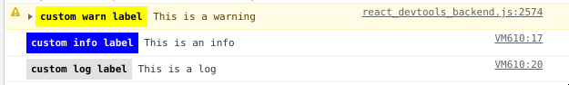

# cologrinchis
Set label colors in your chrome console logs.

## Activity


## Use it

### Install

```shell
npm install cologrinchis --save-dev
```

### Import 

Import the module from your node modules with the namespace as you want:

```javascript
import * as cologger from 'cologrinchis';
```

### Use

```javascript
cologger.warn('custom warn label', 'This is a warning');
cologger.info('custom info label', 'This is an info');
cologger.log('custom log label', 'This is a log');
```

## Example



